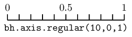
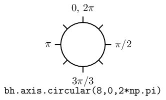
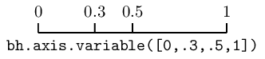
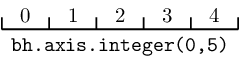
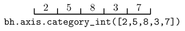

.. _usage-axes:

Axes
====

In boost-histogram, a histogram is collection of Axis objects and a
storage.

Axis types
----------

There are several axis types to choose from.

Regular axis
^^^^^^^^^^^^

.. py:function:: bh.axis.Regular(bins, start, stop, *, metadata="", underflow=True, overflow=True, circular=False, growth=False, transform=None)
   :noindex:

The regular axis can have overflow and/or underflow bins (enabled by default). It can also grow if ``growth=True`` is given. In general, you should not mix options, as growing axis will already have the correct flow bin settings. The exception is ``underflow=False, overflow=False``, which is quite useful together to make an axis with no flow bins at all.

There are some other useful axis types based on regular axis:

.. py:function:: bh.axis.Regular(..., circular=True)
   :noindex:

   This wraps around, so that out-of-range values map back into the valid range circularly.

Regular axis: Transforms
^^^^^^^^^^^^^^^^^^^^^^^^

Regular axes support transforms, as well; these are functions that convert from an external,
non-regular bin spacing to an internal, regularly spaced one. A transform is made of two functions,
a ``forward`` function, which converts external to internal (and for which the transform is usually named),
and a ``inverse`` function, which converts from the internal space back to the external space. If you
know the functional form of your spacing, you can get the benefits of a constant performance scaling
just like you would with a normal regular axis, rather than falling back to a variable axis and a poorer
scaling from the bin edge lookup required there.

You can define your own functions for transforms, see :ref:`usage-transforms`. If you use compiled/numba
functions, you can keep the high performance you would expect from a Regular axis. There are also several
precompiled transforms:

.. py:function:: bh.axis.Regular(..., transform=bh.axis.transform.sqrt)
   :noindex:

   This is an axis with bins transformed by a sqrt.

.. py:function:: bh.axis.Regular(..., transform=bh.axis.transform.log)
   :noindex:

   Transformed by log.

.. py:function:: bh.axis.Regular(..., transform=bh.axis.transform.Power(v))
   :noindex:

   Transformed by a power (the argument is the power).

Variable axis
^^^^^^^^^^^^^

.. py:function:: bh.axis.Variable([edge1, ...], *, metadata="", underflow=True, overflow=True, circular=False, growth=False)
   :noindex:

   You can set the bin edges explicitly with a variable axis. The options are mostly the same as the Regular axis.

Integer axis
^^^^^^^^^^^^

.. py:function:: bh.axis.Integer(start, stop, *, metadata="", underflow=True, overflow=True, circular=False, growth=False)
   :noindex:

   This could be mimicked with a regular axis, but is simpler and slightly faster. Bins are whole integers only,
   so there is no need to specify the number of bins.

One common use for an integer axis could be a true/false axis:

.. code:: python3

   bool_axis = bh.axis.Integer(0, 2, underflow=False, overflow=False)
   :noindex:

Another could be for an IntEnum (Python 3 or backport) if the values are contiguous.

Category axis
-------------

.. py:function:: bh.axis.IntCategory([value1, ...], metadata="", grow=False)
   :noindex:

   You should put integers in a category axis; but unlike an integer axis, the integers do not need to be adjacent.

One use for an IntCategory axis is for an IntEnum (Python 3):

.. code:: python3

    import enum

    class MyEnum(enum.IntEnum):
        a = 1
        b = 5

    my_enum_axis = bh.axis.IntEnum(list(MyEnum), underflow=False, overflow=False)
   :noindex:

.. py:function:: bh.axis.StrCategory([str1, ...], metadata="", grow=False)
   :noindex:

   You can put strings in a category axis as well. The fill method supports lists or arrays of strings
   to allow this to be filled.

Manipulating Axes
-----------------

Axes have a variety of methods and properties that are useful. When inside a histogram, you can also access
these directly on the ``hist.axes`` object, and they return a tuple of valid results. If the property or method
normally returns an array, the ``axes`` version returns a broadcasting-ready version in the output tuple.
