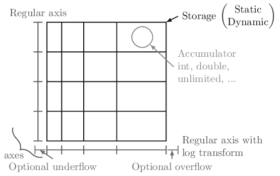
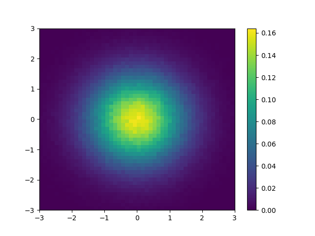

.. _usage-quickstart:

Quickstart
==========

All of the examples will assume the following import:

.. code:: python

   import boost_histogram as bh

In boost-histogram, a histogram is collection of Axis objects and a
storage.

Making a histogram
------------------

You can make a histogram like this:

.. code:: python

   hist = bh.Histogram(bh.axis.Regular(bins=10, start=0, stop=1))

If you’d like to type less, you can leave out the keywords:

.. code:: python

   hist = bh.Histogram(bh.axis.Regular(10, 0, 1))

The exact same syntax is used for 1D, 2D, and ND histograms:

.. code:: python

   hist3D = bh.Histogram(
       bh.axis.Regular(10, 0, 100, circular=True),
       bh.axis.Regular(10, 0.0, 10.0),
       bh.axis.Variable([1,2,3,4,5,5.5,6])
   )

See :ref:`usage-axes` and :ref:`usage-transforms`.

You can also select a different storage with the ``storage=`` keyword argument;
see :ref:`usage-storage` for details about the other storages.

Filling a histogram
-------------------

Once you have a histogram, you can fill it using ``.fill``. Ideally, you
should give arrays, but single values work as well:

.. code:: python

   hist = bh.Histogram(bh.axis.Regular(10, 0.0, 1.0))
   hist.fill(0.9)
   hist.fill([0.9, 0.3, 0.4])

Slicing and rebinning
---------------------

You can slice into a histogram using bin coordinates
or data coordinates using ``bh.loc(v)``. You can also
rebin with ``bh.rebin(n)`` or remove an entire axis
using ``bh.sum`` as the third slice argument:

.. code:: python

    hist = bh.Histogram(
        bh.axis.Regular(10, 0, 1),
        bh.axis.Regular(10, 0, 1),
        bh.axis.Regular(10, 0, 1),
    )
    mini = hist[1:5, bh.loc(0.2):bh.loc(0.9), ::bh.sum)
    # Will be 4 bins x 7 bins

See :ref:`usage-indexing`.

Accessing the contents
----------------------

You can use ``hist.view()`` to get
a numpy array (or a RecArray-like wrapper for non-simple storages).
Most methods like ``.view()`` offer an optional keyword
argument that you can pass, ``flow=True``, to enable the under and
overflow bins (disabled by default).

.. code:: python

    np_array = hist.view()

Setting the contents
--------------------

You can set the contents directly as you would a numpy array;
you can set either values or arrays at a time:

.. code:: python

    hist[2] = 3.5
    hist[bh.underflow] = 0 # set the underflow bin
    hist2d[3:5, 2:4] = np.eye(2) # set with array

See :ref:`usage-indexing`.

Accessing Axes
--------------

The axes are directly available in the histogram, and you can access
a variety of properties, such as the ``edges`` or the ``centers``. All
properties and methods are also available directly on the ``axes`` tuple:

.. code:: python

   ax0 = hist.axes[0]
   X, Y = hist.axes.centers

See :ref:`usage-axes`.

Computing with Histograms
-------------------------

As an complete example, let's say you wanted to compute and plot the density:

.. literalinclude:: ../../examples/simple_density.py
   :language: python

Comparing with Boost.Histogram
------------------------------

This is built on the Boost.Histogram library.

See :ref:`usage-comparison`.
